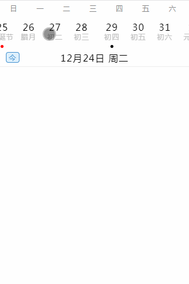

# vue-calendar


## Project setup
```
npm install
```

### Compiles and hot-reloads for development
```
npm run serve
```

### Compiles and minifies for production
```
npm run build
```

### Lints and fixes files
```
npm run lint
```

### Build Library
```
npm run lib
```

### Customize configuration
See [Configuration Reference](https://cli.vuejs.org/config/).


#### Fork From [vue-hash-calendar](https://github.com/TangSY/vue-hash-calendar)
